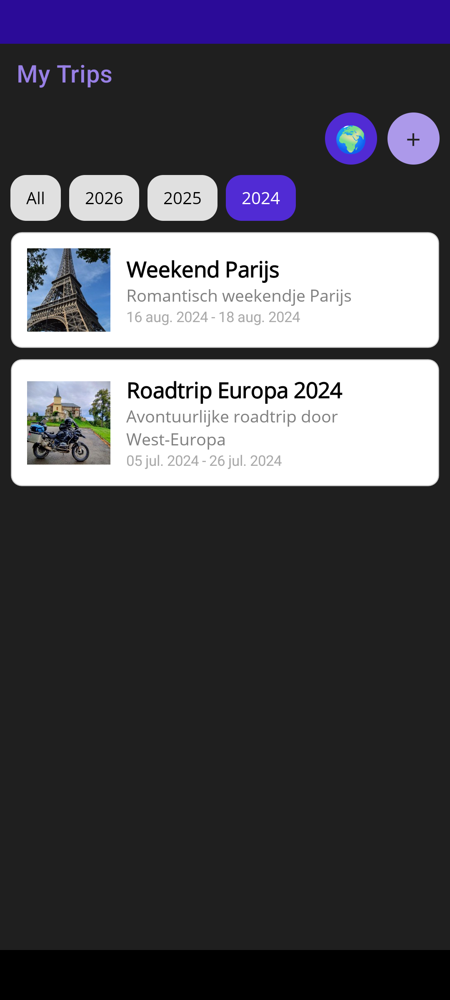
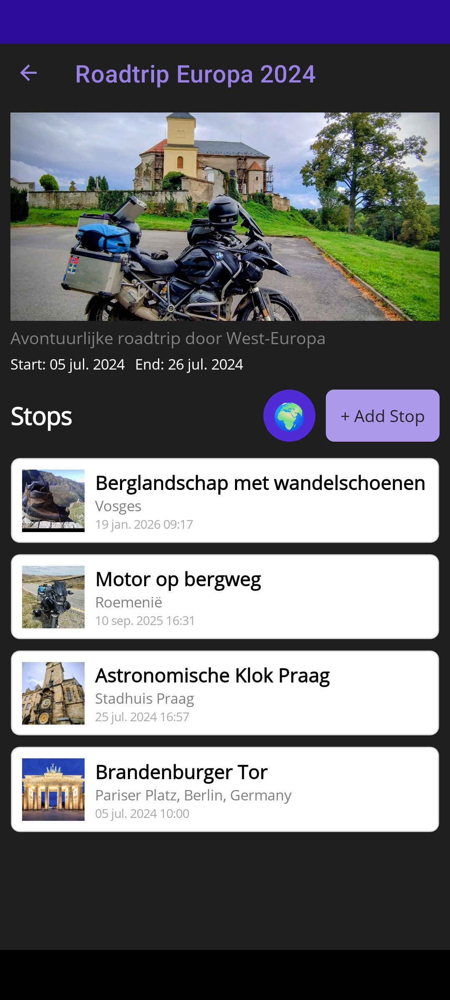
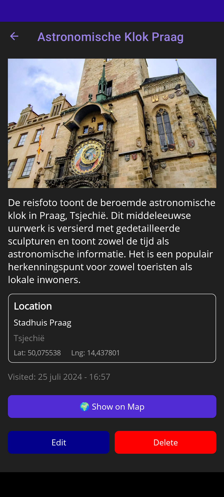
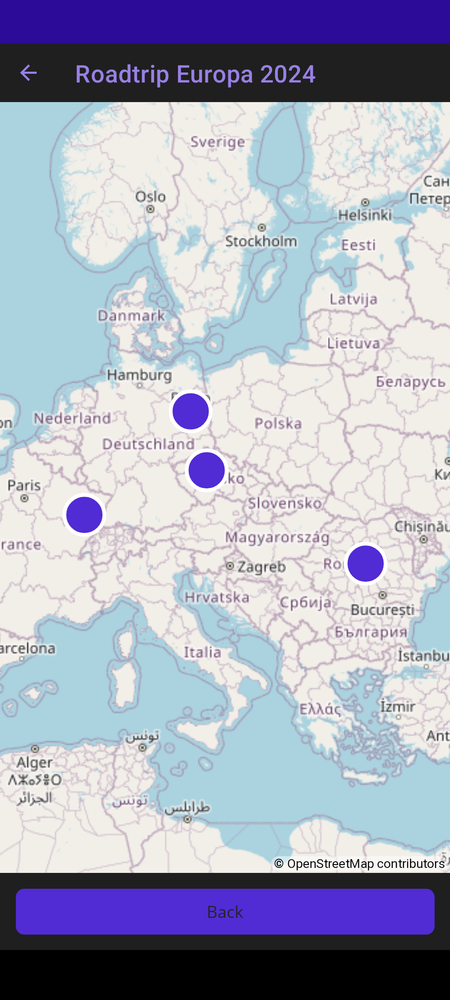
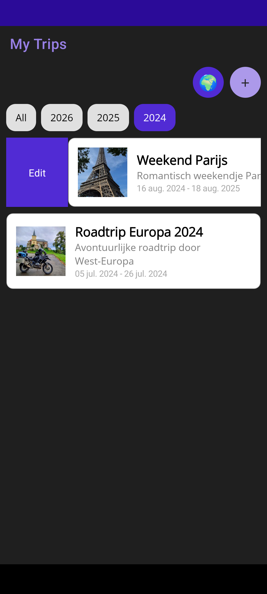
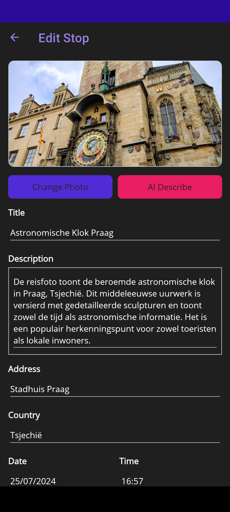
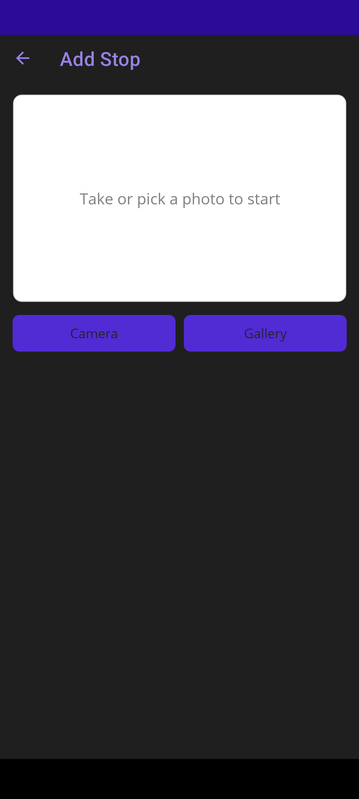
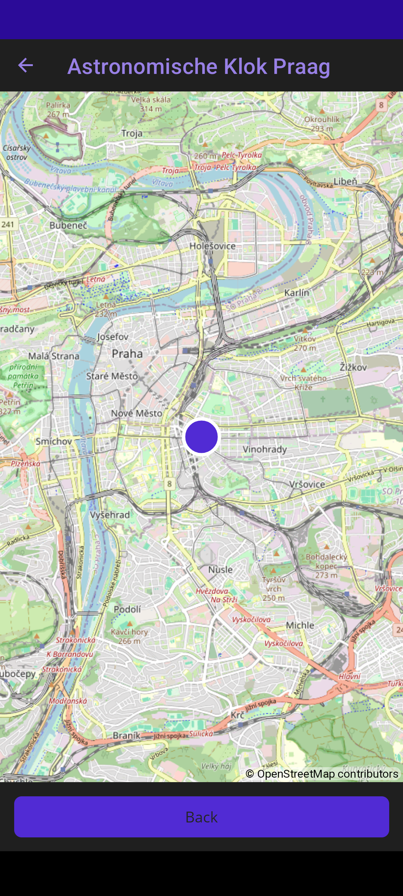

# TripTracker

Een cross-platform mobile app waarmee je reizen kunt plannen en bijhouden, met foto's, GPS-locatie, interactieve kaarten en AI-beeldherkenning.

> Schoolproject voor AI.NET - Thomas More Hogeschool (score: 19/20)

| Trips overzicht | Trip detail |
|-----------------|-------------|
|  |  |

| Stop detail (AI-beschrijving) | Kaart overzicht |
|-------------------------------|-----------------|
|  |  |

| Swipe to edit | Edit stop |
|---------------|-----------|
|  |  |

| Add stop | Stop op kaart |
|----------|---------------|
|  |  |

## Tech stack

| Laag | Technologie |
|------|-------------|
| Frontend | .NET MAUI (cross-platform mobile) |
| Backend | ASP.NET Core Web API |
| Database | SQL Server LocalDB + Entity Framework Core |
| AI | OpenAI GPT-4o Vision API |
| Mapping | Mapsui (OpenStreetMap), SkiaSharp |
| Patterns | MVVM (CommunityToolkit.Mvvm), Repository, AutoMapper |

## Features

- **Reizen beheren** - aanmaken, bewerken en verwijderen van trips met foto's en datums
- **Stops per reis** - toevoegen met GPS-locatie, foto, adres en land
- **AI beeldherkenning** - automatische beschrijving van reisfoto's via OpenAI Vision
- **Interactieve kaarten** - overzichtskaart per reis + detailkaart per stop (Mapsui/OpenStreetMap)
- **Automatische geocoding** - GPS-coordinaten worden omgezet naar adres en land
- **Jaarfilter** - trips filteren op jaar (All, 2024, 2025, 2026)
- **Camera + galerij** - foto's maken of kiezen uit galerij
- **MVVM architectuur** - clean separation of concerns met ViewModels en Services
- **Cross-platform** - draait op Android, iOS en Windows

## Opstarten

```bash
# Clone repo
git clone https://github.com/stijn-portfolio/triptracker.git

# API starten
cd TripTracker.API
dotnet run

# MAUI app starten (Visual Studio 2022+ vereist)
# Open TripTracker.sln in Visual Studio en start TripTracker.App
```

Voor Android: start een ngrok tunnel (`ngrok http 5206`) en update de `BASE_URL` in `ApiService.cs`.

## Projectstructuur

```
TripTracker/
  TripTracker.API/            REST API backend
    Controllers/              API endpoints (Trips, TripStops)
    Entities/                 Database models
    Models/                   DTOs
    Repositories/             Repository pattern
    MappingProfiles/          AutoMapper configuratie
    DbContexts/               EF Core context met seed data
  TripTracker.App/            .NET MAUI frontend
    ViewModels/               MVVM ViewModels
    Views/                    XAML pages (Trips, Detail, Map, Add/Edit)
    Services/                 API, Geocoding, Geolocation, Photo, AI
    Models/                   App-side models
    Converters/               Value converters
  docs/                       Ontwikkeldocumentatie
```

## Architectuur

- **Repository pattern** - interface-first design, DTOs gescheiden van entities
- **MVVM** - CommunityToolkit.Mvvm met ObservableProperty en RelayCommand
- **WeakReferenceMessenger** - cross-ViewModel communicatie (trip updates, stop changes)
- **Service layer** - API communicatie, device services (camera, GPS, geocoding)
- **Dependency injection** - alle services en ViewModels via DI container
